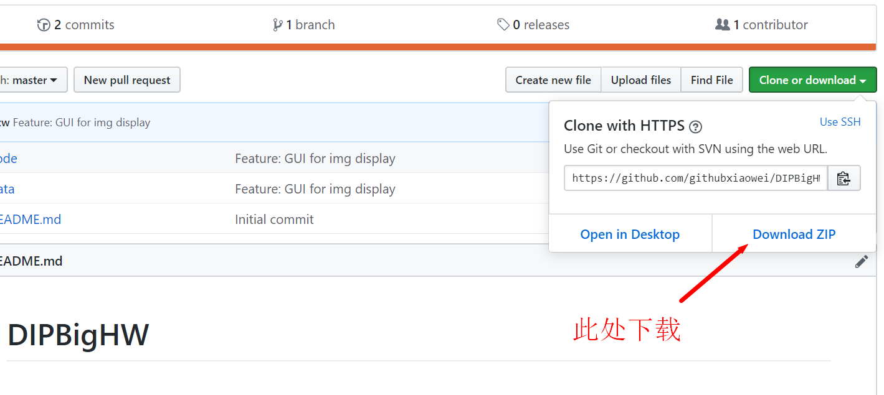
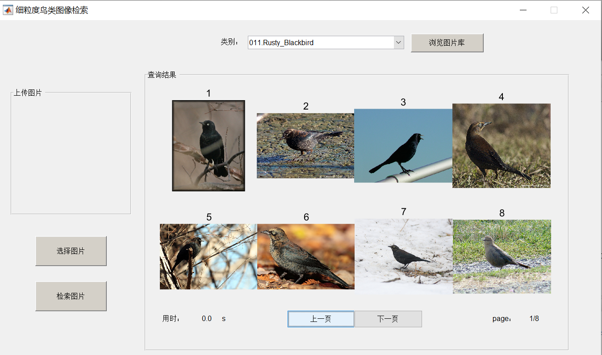
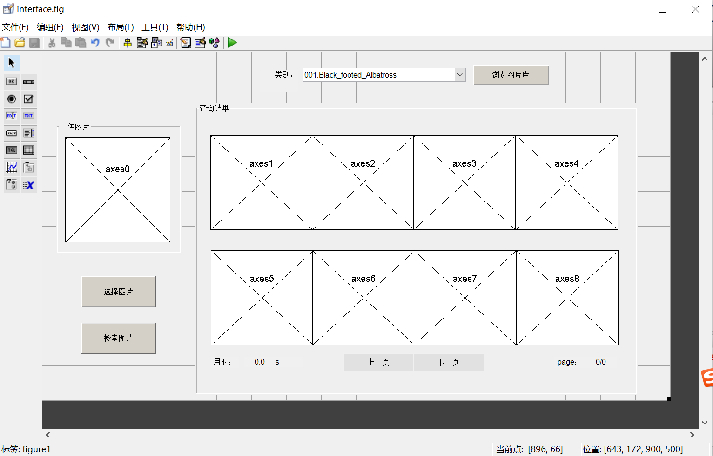

# DIPBigHW

## 下载此代码
命令行下载
```
git clone https://github.com/githubxiaowei/DIPBigHW.git
```
或者如图直接点击下载：


## 在matlab中运行
 1. 将数据集 CUB_200_2011.tgz 解压到 data/ 目录下
 2. matlab 进入code目录
 3. 运行 interface.m，这个脚本会打开 interface.fig 作为图形界面
* 选择类别，点击“浏览图片库”按钮，可以展示该类别下的所有图片。下方两个按钮实现翻页

* 左侧两个按钮分别实现打开图片、检索并在右侧展示相似图片的功能（未实现）
* 在 matlab 命令行输入 guide 可以编辑图形界面


### TODO
在 code/interface.m 的如下函数为“检索图片”按钮的回调函数，大概在200行左右。

需要把检索得到的图片集合返回给下方倒数第3行的 I，而不是给它空集。
```matlab
% --- Executes on button press in searchbutton.
function searchbutton_Callback(hObject, eventdata, handles)
% hObject    handle to searchbutton (see GCBO)
% eventdata  reserved - to be defined in a future version of MATLAB
% handles    structure with handles and user data (see GUIDATA)
global g_state;
if isnan(g_state.img)
    errordlg('您还没有选取图片！！','温馨提示');%如果没有输入，则创建错误对话框
else
    axes_list = [handles.axes1,handles.axes2,handles.axes3,handles.axes4,...
             handles.axes5,handles.axes6,handles.axes7,handles.axes8];
    
    %TODO: return images similar with g_state.img
    I = {};
    ...
         
end
```

