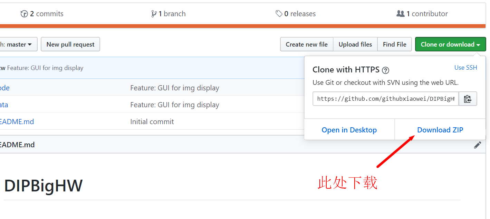
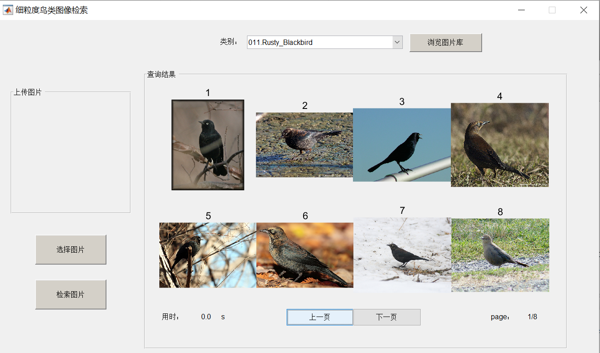
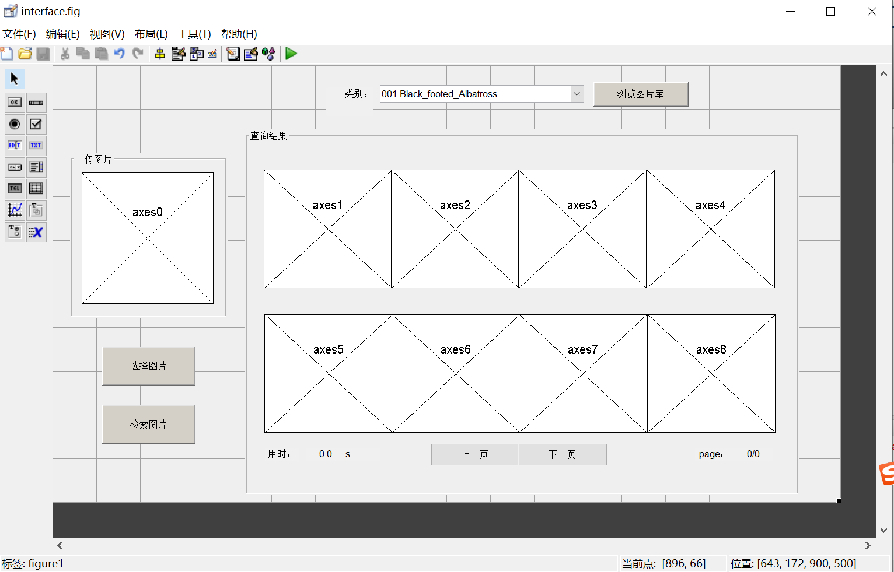

# DIPBigHW

## 下载此代码
命令行下载
```
git clone https://github.com/githubxiaowei/DIPBigHW.git
```
或者如图直接点击下载：



## 在matlab中运行
 1. 将数据集 CUB_200_2011.tgz 解压到 data/ 目录下
 2. matlab 进入code目录
 3. 运行 interface.m，这个脚本会打开 interface.fig 作为图形界面
* 选择类别，点击“浏览图片库”按钮，可以展示该类别下的所有图片。下方两个按钮实现翻页



* 左侧两个按钮分别实现打开图片、检索并在右侧展示相似图片的功能（未实现）
* 在 matlab 命令行输入 guide 可以编辑图形界面



### TODO
在 code/interface.m 中，“检索图片”按钮的回调函数为：
```matlab
function showbutton_Callback(hObject, eventdata, handles)
```
其内部调用函数 retrieve_top50.m 来从数据库中检索前 50 张最相似的图片：
```matlab
function [ I ] = retrieve_top50(method)
%retrieve_top50 从数据集中检索出前五十张相似图片
%   method：整数类型 检索方法
%   I：cell类型 大小50x1，每个cell包含一张图片的路径
%   
global g_state;
% g_state.img 当前图片
global g_bird_data;
% g_bird_data.img_paths 数据库所有图片的路径
I = {};
end
```

#### 待实现的检索方法：

全局特征
- [ ] YUV histogram
- [ ] RGB histogram
- [ ] HSV histogram
- [ ] gray histogram


对象区域特征（通过目标检测、分割）
- [ ] YUV histogram
- [ ] RGB histogram
- [ ] HSV histogram
- [ ] gray histogram

基于部件特征
- [ ] ？

基于深度学习
- [ ] ？
