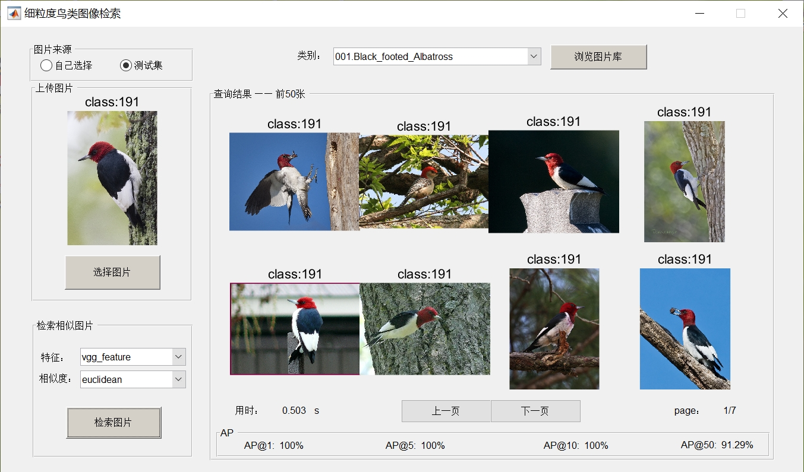
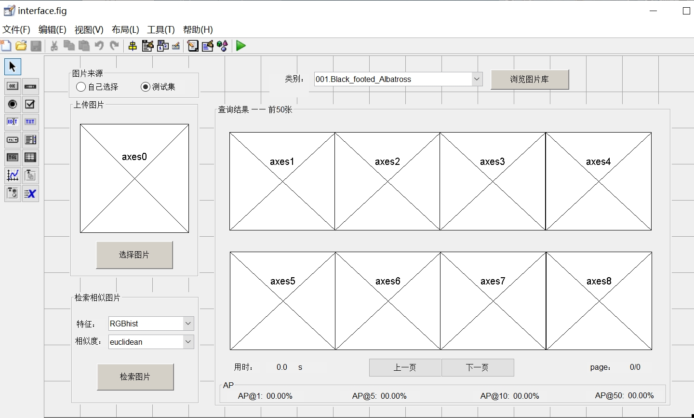

# DIPBigHW

## 下载此代码

命令行下载

```
git clone https://github.com/githubxiaowei/DIPBigHW.git
```

或者如图直接点击下载：


## 数据集下载

数 据 集 下 载 链 接 （ 图 像 + 所 有 标 注 ） ：
http://www.vision.caltech.edu/visipedia-data/CUB-200-2011/CUB_200_2011.tgz

## 环境
- matlab 2016b
- python 3.6 + tensorflow 1.9.0 + keras 2.2.4 + opencv

## 程序运行

 1. 将数据集 CUB_200_2011.tgz 解压到 data/ 目录下
 2. 进入 code/ 目录
 3. 用 python 运行 py_server 目录下的 py_server.py, 保持该程序在后台运行
 ```
 (py36) ~\code> python py_server\py_server.py
 ```
 4. 用 matlab 运行 prepare_feature.m，对整个数据集提取特征，结果会保存在 features/ 目录下
 5. 运行 interface.m，这个脚本会打开 interface.fig 作为图形界面

## 界面

* 选择类别，点击“浏览图片库”按钮，可以展示该类别下的所有图片。下方两个按钮实现翻页



* 左上方两个单项选择按钮指示图片来源，当选中“测试集”时，单击“选择图片”按钮将自动从测试集中选择一张图片
* 左侧两个长方形按钮分别实现打开图片、检索并展示图片的功能
* 用户可以通过下拉菜单选择图片的特征类型和相似度的计算方式
* 在 matlab 命令行输入 guide 可以编辑图形界面



## TODO

添加新的计算图片特征的方式，并在 init_data_params.m 中注册：

```matlab
%注册特征名称
g_bird_data.features.classes = {...
    'RGBhist',...
    'HSVhist',...
};
%注册计算特征的函数名
g_bird_data.features.functions = {...
    @feat_RGBhist,...
    @feat_HSVhist,...
};
```

注册完成后，直接运行 prepare_feature.m 即可在 features/ 目录下生成新的特征数据。

#### 待实现的检索方法：

全局特征

- [ ] YUV histogram
- [x] RGB histogram
- [x] HSV histogram

对象区域特征（通过目标检测、分割）

- [ ] YUV histogram
- [x] RGB histogram
- [ ] HSV histogram

基于部件特征

- [ ] ？

基于深度学习

- [x] vgg feature

## 效果展示


